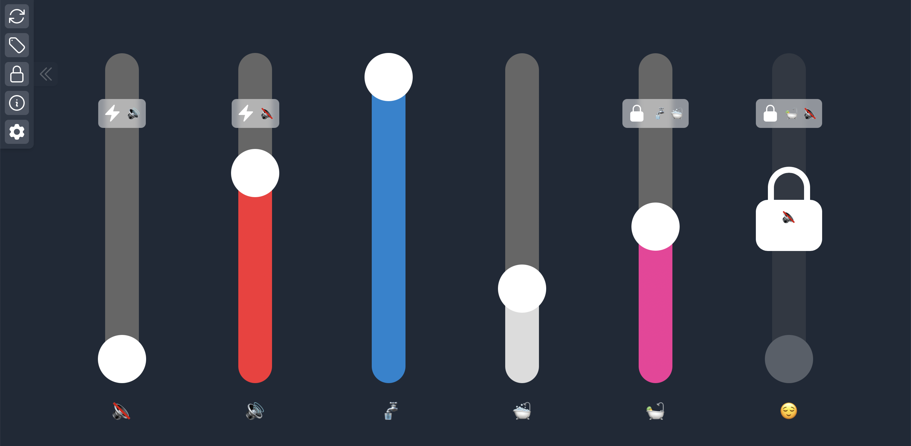

# Slider Logic

This is a small [React](https://react.dev) application to interact with sliders that follow custom rules.

While it is hosted [publically](https://kiljank.github.io/slider-logic/), the application is not a public service or a product. It is only hosted with this visibility, so that I can access it quickly from my phone for private use.



> [!WARNING]
> If you want to use this, keep in mind that the code quality is not optimal and some of the logic is highly convoluted. I simply needed an app with the features implemented here for personal demonstration purposes, so I quickly threw this together on a friday afternoon.

## Settings Guide

You can set up relatively complex, cascading logic for multiple sliders. This includes [mutual exclusiveness](README.md#mutual-exclusiveness), [equivalency](README.md#equivalency), and also [locking](README.md#slider-requirements) sliders until a set of different sliders holds value.

Slider settings can be written into the application by clicking on the gear icon, which will paste any settings from the clipboard (or prompt for them on mobile).

Settings objects are JSON objects that consist of the following structure:
```json
{
  "names": {...},
  "rules": {...},
}
```

### Names

The `names` object is intended to hold unique keys that map to objects of the following structure:
```json
{
  "color": "rgb(140, 82, 24)",
  "labels": { "short": "B", "long": "Bear" },
}
```

### Rules

The `rules` object should hold three keys:
- `exclusions` (holds an array)
- `equivalencies` (holds an array)
- `requirements` (holds an object)

> [!NOTE]
> The rules should use the keys from the `names` object when referencing sliders.

> [!CAUTION]
> Make sure that the rules you define are not cyclical or contradictory, as this will likely break the application or cause a major freeze-up.

#### Mutual Exclusiveness

Mutual exclusiveness is defined through an array of sub-arrays. Each sub-array describes a pair of mutually exclusive sliders as follows:
```json
[
  ["quiet", "loud"]
]
```

#### Equivalency

Equivalency between two sliders is also defined through an array of sub-arrays. Each sub-array describes a pair of equivalent sliders as follows:
```json
[
  ["bath", "comfort"]
]
```

#### Slider Requirements

Requirements are defined slightly differently. The `requirements` object can have keys that match the `name` key of a slider. It is possible to store an array under that key, which will include all keys of the sliders that are required to have a value before this slider can be moved.
```json
{
  "bath": ["water", "bathtub"]
}
```

## Application Icon

